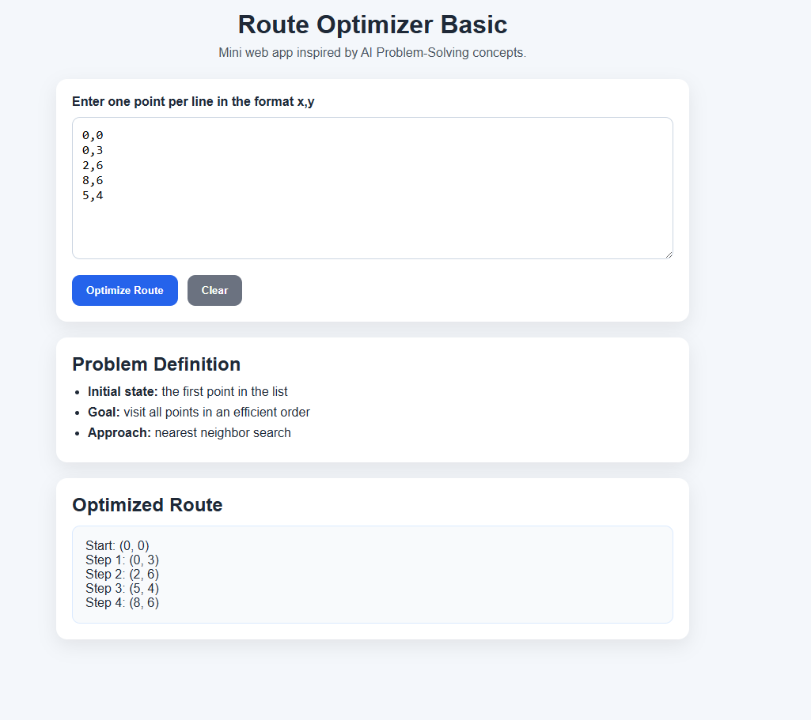

# Route Optimizer Basic

## 📸 App Preview

### Initial State

### Optimized Result

A simple web app built with HTML, CSS and JavaScript to simulate a basic AI problem-solving scenario.

## 🧠 Project Overview

This project represents a simple approach to solving a route optimization problem.

The user enters coordinate points (x,y), and the app calculates a route using a nearest-neighbor strategy.

## ⚙️ How it works

1. The first point is treated as the initial state.
2. The algorithm selects the closest next point.
3. The process repeats until all points are visited.

## 🚀 Features

- Input validation
- Route optimization (basic)
- Distance calculation
- Clean UI

## 🛠 Technologies

- HTML
- CSS
- JavaScript

## 📦 Example Input

0,0
2,3
5,1
1,4

## 📊 Example Output

Start: (0,0)  
Step 1: (2,3)  
Step 2: (1,4)  
Step 3: (5,1)

## 🧩 Concepts Applied

- AI Problem-Solving
- Initial State & Goal
- Search Strategy
- Heuristics (Nearest Neighbor)

## 🔗 Live Demo

👉 [View the app](https://devcodemate.github.io/route-optimizer-basic/)

## 📁 Repository

https://github.com/devCODEMATE/route-optimizer-basic

## 💡 Future Improvements

- Visual route rendering
- Map integration
- Multiple optimization strategies
